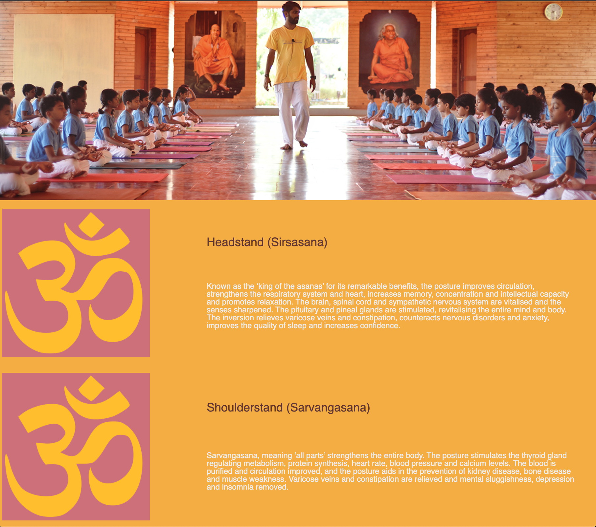
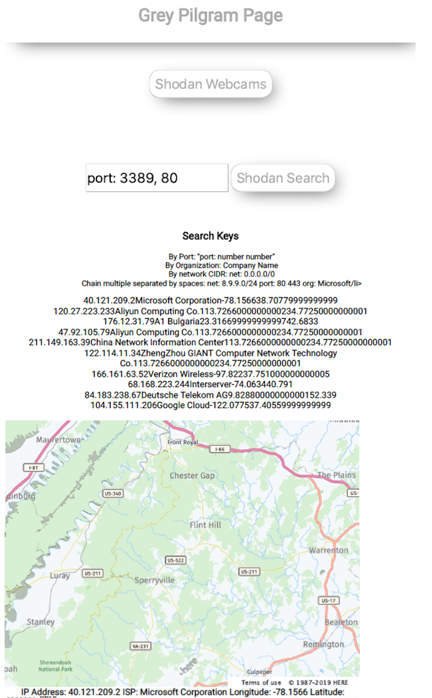
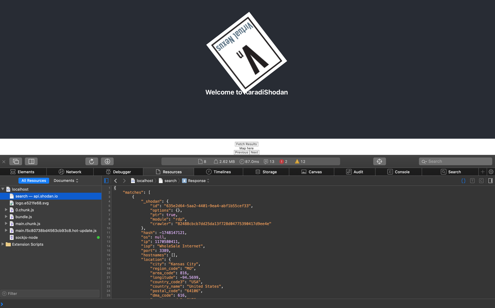
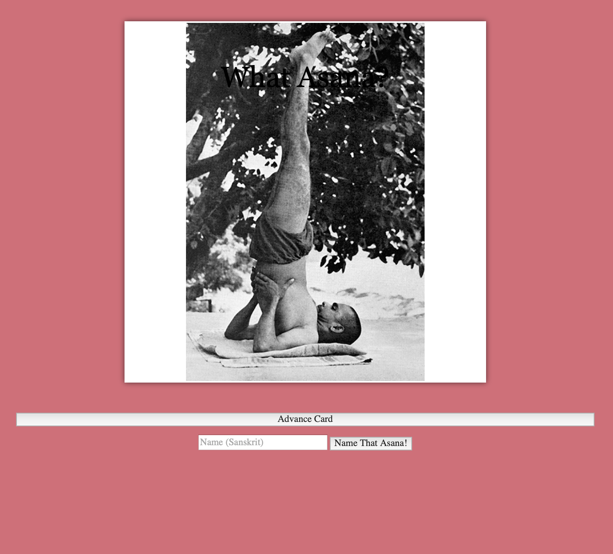
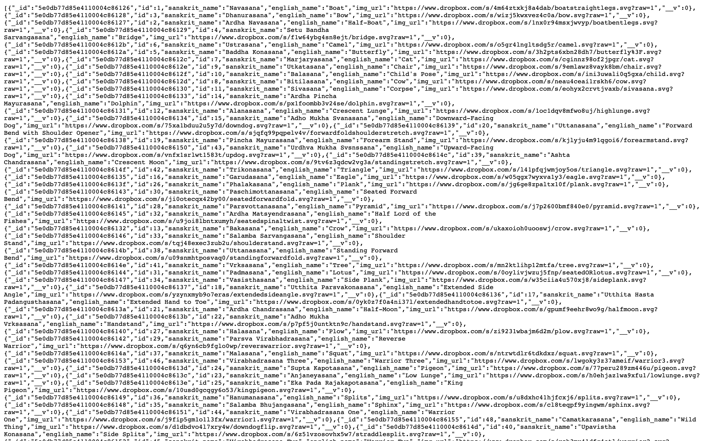
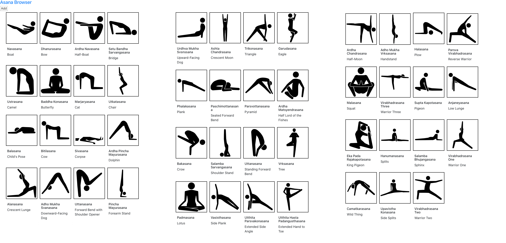

# Please find Gouthum "Karate" Karadi's Professional Github Page
* This page is the root of KaradiKid's reinvention post General Assembly Boot Camp
* It includes varying technologies as Karadi progressed from old school programmer to new school:
+ Javascript
+ Node
+ React
+ Serverless
    - Already an expert in cloud
+ MongoDB
+ Python
+ SQL
    - Expert already in RDBMS

## There are also many sample projects from GA bootcamp

### Week 1 Yoga Hover Cards

[Yoga Cards Hover - AWS S3 Hosted](http://yoga.ommygod.com)

[Github Default Hosting](https://karadikid.github.io/sivananda-card)

### Week 3 Shodan API Search with Strip Maps from Here

[Shodan API Search, Requires Key](https://karadikid.github.io/shodan-api-js)

#### Shodan React

### Week 4 Yoga Flash Cards with Scoring

[Yoga Flash Cards - AWS S3 Hosted](http://cards.ommygod.com)
[Github Default Hosting](https://karadikid.github.io/flash-cards)

### Week 5-6 Yoga API and Website MERN STACK

#### YOGA API Using Mongo/Mongoose, Express and Node

[Yoga API - Heroku Hosted](https://yogapi.herokuapp.com)
[Yoga API Github](https://github.com/karadikid/yoga-api)

#### Yoga Asanas Browser Web App using React

[Asana Browser - AWS Amplify Serverless Hosted CI/CD](https://asanas.ommygod.com/)
[Asana Browser - Github Repo](https://github.com/karadikid/asana-browser)

Please enjoy any of the repositories at KaradiKid.github.io/repositoryName

# Licensing
## WTFPL
### Apache

- Share them
- Modify them

1. Have Fun
2. Please submit pull requests as needed.
